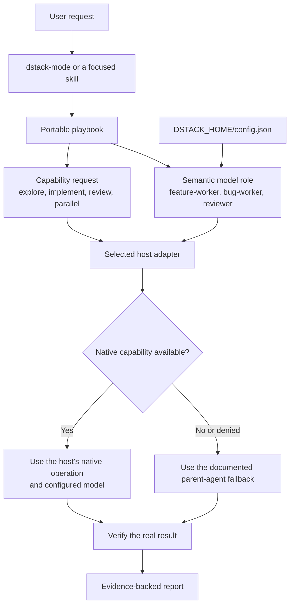
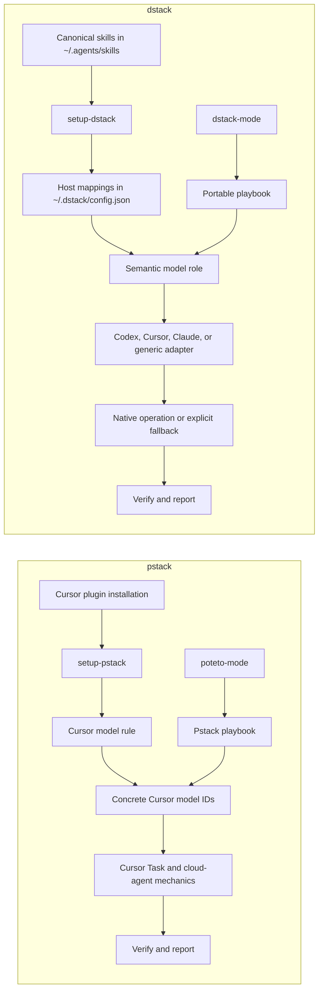

# dstack

dstack is a provider-neutral adaptation of
[pstack](https://github.com/cursor/plugins/tree/main/pstack). It keeps pstack's
engineering skills and playbook discipline while moving host-specific model
selection and agent mechanics behind explicit adapters.

The current repository contains 45 portable skills: counterparts for all 44
pstack skills at the recorded upstream baseline, plus `comment-sicko` as a
normal reusable skill. It supports Codex, Cursor, Claude Code, and a generic
Agent Skills fallback.

> **Current status:** the portable skills, minimal installer, adapters, and
> per-host model configuration are implemented and statically validated. Live
> host conformance is still unrecorded. Pstack's project-scale Orchestrate
> runtime is a deferred TODO and is not required for normal dstack workflows.

## How dstack works



Skills express intent. The active adapter translates that intent into mechanics
that the current host actually supports. Missing capabilities degrade
explicitly instead of borrowing another provider's tool parameters.

## dstack compared with pstack



| Concern | pstack | dstack |
| --- | --- | --- |
| Primary host | Cursor | Codex, Cursor, Claude Code, generic |
| Main entry point | `poteto-mode` | `dstack-mode` |
| Model configuration | Cursor rule with concrete models | Per-host semantic model-and-effort bindings in `config.json` |
| Agent mechanics | Embedded Cursor assumptions | Adapter capability contract |
| Canonical skill location | Cursor plugin installation | `~/.agents/skills` |
| Missing capability | Usually assumes Cursor support | Declared parent-agent fallback |
| Private transcripts | Some source workflows inspect Cursor storage | Only authorized history or explicit inputs |
| Orchestrate | Playbook and TypeScript store included | Deferred TODO |

## Install

From this repository, preview every operation first:

```bash
python3 install.py --dry-run
```

Install canonical skills and dstack support files:

```bash
python3 install.py
```

This copies skills to `~/.agents/skills/` and copies adapters, contracts,
schemas, licensing files, and any shipped runtime into `DSTACK_HOME` (default
`~/.dstack/`).

Claude Code compatibility links are opt-in:

```bash
python3 install.py --dry-run --with-claude-links
python3 install.py --with-claude-links
```

The default installer is intentionally first-install-only. Any existing destination
file, directory, valid link, or broken link stops the entire installation
before writes begin. It does not repair, uninstall, or install Bun.

To refresh a verified dstack installation from a trusted checkout, preview and
then run the explicit update mode:

```bash
python3 install.py --update --dry-run
python3 install.py --update
```

Update mode requires the canonical skill and support roots to exist and every
existing managed destination to have the expected topology and skill identity.
It creates missing managed artifacts inside those roots, stages
replacements, rolls back on failure, preserves `DSTACK_HOME/config.json`, and leaves existing Claude
compatibility links pointing at the canonical skill paths.

## Configure models

Run `setup-dstack` once in each host where you want custom model assignments.
It discovers only exact model-effort pairs the active host can verify, shows the
proposed mapping, waits for confirmation, and atomically updates
`~/.dstack/config.json`.

Codex and Cursor settings coexist in the same file. Configuring one host
preserves the other. Without a configuration file, every role inherits the
parent model.

The six version-2 roles are:

- `fast-explorer`
- `feature-worker`
- `bug-worker`
- `deep-judgment`
- `skeptical-reviewer`
- `independent-judge`

Schema version 1 remains accepted as migration input. Run the installed
configurator's `migrate` command to write version 2 without guessing effort;
every migrated effort initially inherits from the parent.

## Use

Use `dstack-mode` as the normal front door:

```text
dstack-mode: users receive two notifications after a retry. Reproduce it,
fix the cause, and verify the real flow.
```

Use focused skills directly when you want a narrower operation:

```text
how does authentication state reach this route?
```

```text
arena these two API designs before we commit to one.
```

```text
interrogate this plan for correctness and unnecessary complexity.
```

## Guide

1. [Install and configure dstack](./docs/guide/01-install-and-configure.md)
2. [Understand the runtime flow](./docs/guide/02-how-dstack-works.md)
3. [Route work through dstack-mode](./docs/guide/03-dstack-mode.md)
4. [Choose focused workflows](./docs/guide/04-workflows.md)
5. [Maintain dstack and sync pstack](./docs/guide/05-maintaining-dstack.md)

Start with the [guide index](./docs/guide/README.md). Future maintainers should
also read [REMAINING.md](./REMAINING.md) before changing portability contracts
or syncing a new pstack release.

## Validate the repository

```bash
python3 scripts/audit_portability.py
python3 -m unittest discover -s tests -v
python3 -m json.tool schemas/config.schema.json >/dev/null
```

These checks prove repository structure and deterministic helpers. They are not
live Codex, Cursor, Claude, browser, simulator, or multi-agent proof. Live
results belong in [`conformance/HOST_MATRIX.md`](./conformance/HOST_MATRIX.md).

## Provenance

dstack adapts pstack by Lauren Tan and portability concepts from
[ystack](https://github.com/Go7hic/ystack). See [NOTICE.md](./NOTICE.md) and
[LICENSE](./LICENSE). ystack is a useful reference, not a compatibility target;
reinspect its current revision before borrowing new implementation ideas.
