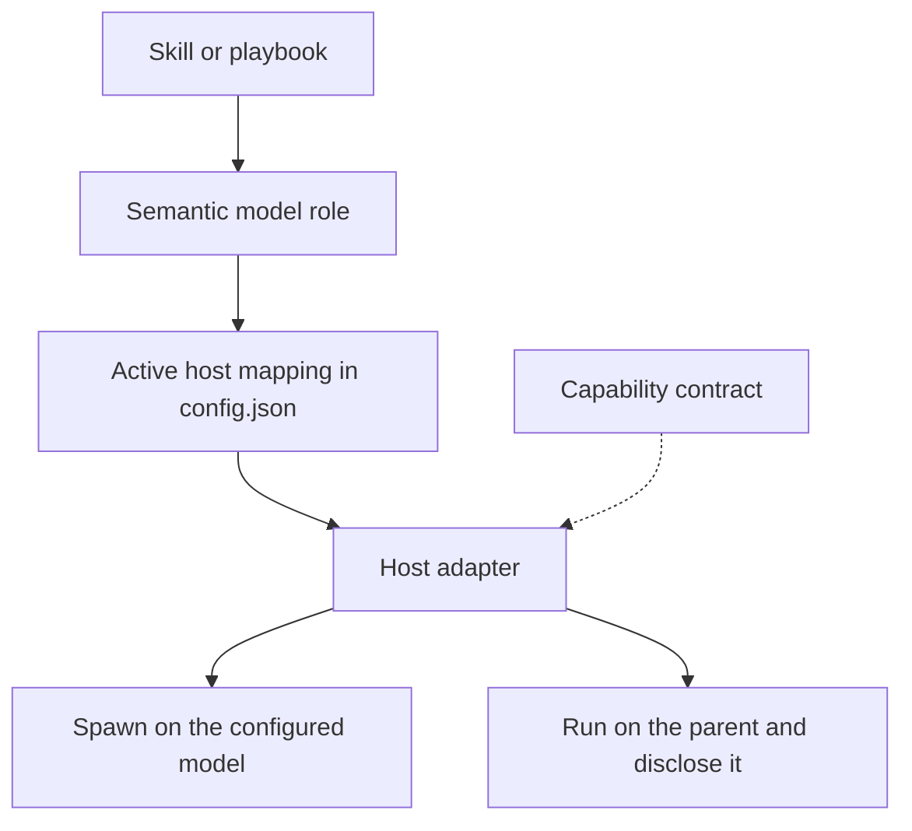
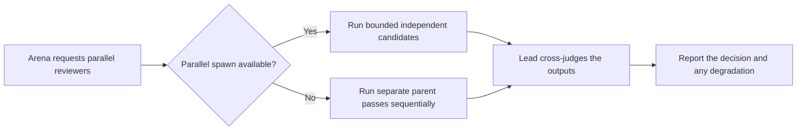

# Understand how dstack works

dstack separates portable workflow intent from host mechanics.

## The layers



### Skills and playbooks

Skills describe the engineering workflow: investigate, design, implement,
review, verify, and report. They are written in plain engineering language.
They never contain a provider's agent-call schema, a concrete model identifier,
or a private transcript path.

`dstack-mode` is the main router. Focused skills such as `how`, `why`, `arena`,
and `interrogate` may also be invoked directly.

### Semantic model roles

A skill names the kind of thinking a piece of work needs, not a model:

- `fast-explorer` for broad, inexpensive tracing;
- `feature-worker` for bounded, spec-driven implementation;
- `bug-worker` for evidence-backed fixes;
- `deep-judgment` for architecture and synthesis;
- `skeptical-reviewer` for independent criticism;
- `independent-judge` for a verdict that must not come from the author.

Where a host cannot choose a child model, the role inherits the parent's, which
is a valid configuration rather than a failure.

### Personal configuration

`DSTACK_HOME/config.json` binds each role to an exact model-and-effort pair per
host, so the same portable workflow resolves differently in Codex and Cursor. A
binding is never copied between hosts automatically. Adapters validate model and
effort together when the current host exposes both values; otherwise effort
inherits and validation availability is reported honestly.

The file also holds `panels`: named lists of roles for the workflows that fan
out across several models at once.

```text
arena-runners -> skeptical-reviewer, deep-judgment
```

Those lists are stored and validated but not yet read by the panel workflows.
See [REMAINING.md](../../REMAINING.md).

### Capability contract and host adapter

[`contracts/capabilities.md`](../../contracts/capabilities.md) is the reference
for what a host can be expected to do, and each adapter classifies every entry
as `enforced`, `native`, `advisory`, `approval-required`, or `unavailable`. It
describes hosts; portable skills do not call capabilities by name.

An adapter is a normal expectation, not proof that a tool is present in the
current session. Before the first helper operation, reconcile it with the tools
and permissions actually visible. Every optional capability has a parent-agent
fallback: if helper creation is unavailable, the parent does the work itself and
the report says fan-out collapsed.

## Host selection

[`contracts/host-selection.md`](../../contracts/host-selection.md) defines this
precedence:

1. explicit per-session override;
2. matching native identity plus tool signature;
3. recognized environment without a conflicting tool surface;
4. generic adapter.

An environment variable or filesystem path alone is weak evidence. If the host
identity and visible tools disagree, select generic and use only observed
capabilities.

## What degradation looks like

Suppose `arena` requests four independent runners:



The fallback preserves the reasoning stages but does not claim independent
isolation or concurrency that the host did not provide.

## Privacy boundary

dstack does not scan private provider transcript directories. Session-oriented
skills may use:

- first-class authorized history resources;
- an explicit transcript, export, URL, or path supplied for the task;
- visible conversation and repository evidence;
- a compact handoff from the parent.

Unavailable history becomes an evidence gap, not a reason to guess a private
filesystem layout.

Next: [Route work through dstack-mode](./03-dstack-mode.md).
