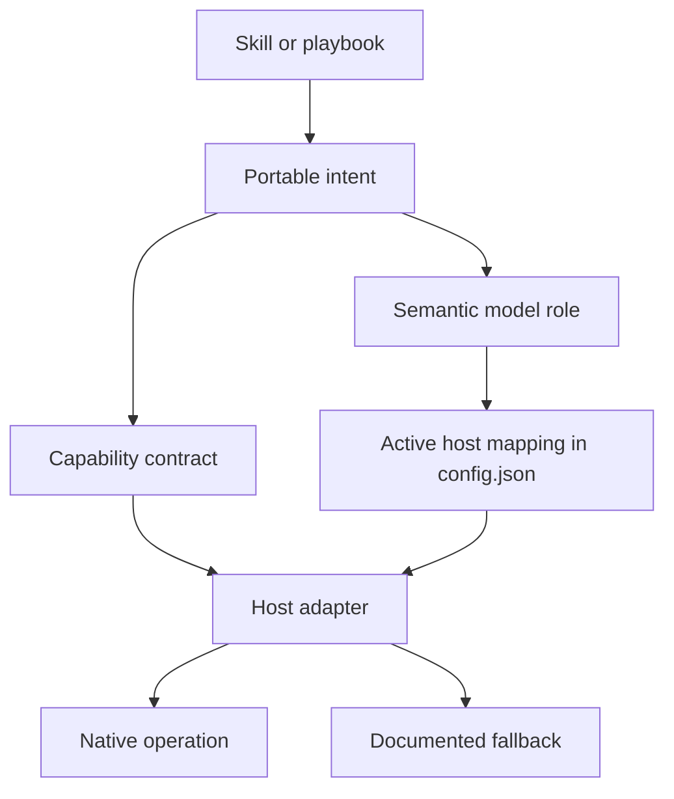
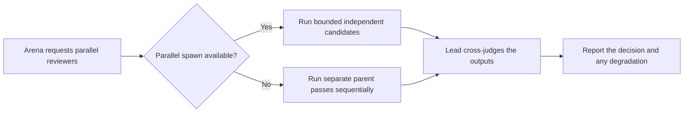

# Understand how dstack works

dstack separates portable workflow intent from host mechanics.

## The four layers



### Skills and playbooks

Skills describe the engineering workflow: investigate, design, implement,
review, verify, and report. They do not contain a provider's agent-call schema
or concrete model identifier.

`dstack-mode` is the main router. Focused skills such as `how`, `why`, `arena`,
and `interrogate` may also be invoked directly.

### Capability contract

[`contracts/capabilities.md`](../../contracts/capabilities.md) names stable
intent such as:

```text
explore
implement
review
parallel
ask_user
verify
model_role
agents.spawn
agents.wait
session.history
runtime.wake
```

Every optional capability used by a portable skill has a parent-agent fallback.
For example, if helper creation is unavailable, the parent executes the packet
itself and reports that fan-out collapsed.

### Host adapter

The selected adapter classifies each capability as:

- `enforced`
- `native`
- `advisory`
- `approval-required`
- `unavailable`

An adapter is a normal expectation, not proof that a tool is present in the
current session. Before the first helper operation, reconcile it with the tools
and permissions actually visible.

### Personal configuration

`DSTACK_HOME/config.json` maps semantic roles to exact model identifiers for
each host. Skills and panels refer to roles, so the same portable workflow can
resolve differently in Codex and Cursor.

Panels contain semantic roles rather than model identifiers:

```text
arena-runners -> skeptical-reviewer, deep-judgment
```

On Codex, those roles use the Codex host table. On Cursor, they use the Cursor
host table. A model identifier is never copied between hosts automatically.

## Host selection

[`contracts/host-selection.md`](../../contracts/host-selection.md) defines this
precedence:

1. explicit per-session override;
2. matching native identity plus tool signature;
3. recognized environment without a conflicting tool surface;
4. generic adapter.

An environment variable or filesystem path alone is weak evidence. If the host
identity and visible tools disagree, select generic and use only observed
capabilities.

## What degradation looks like

Suppose `arena` requests four independent runners:



The fallback preserves the reasoning stages but does not claim independent
isolation or concurrency that the host did not provide.

## Privacy boundary

dstack does not scan private provider transcript directories. Session-oriented
skills may use:

- first-class authorized history resources;
- an explicit transcript, export, URL, or path supplied for the task;
- visible conversation and repository evidence;
- a compact handoff from the parent.

Unavailable history becomes an evidence gap, not a reason to guess a private
filesystem layout.

Next: [Route work through dstack-mode](./03-dstack-mode.md).
