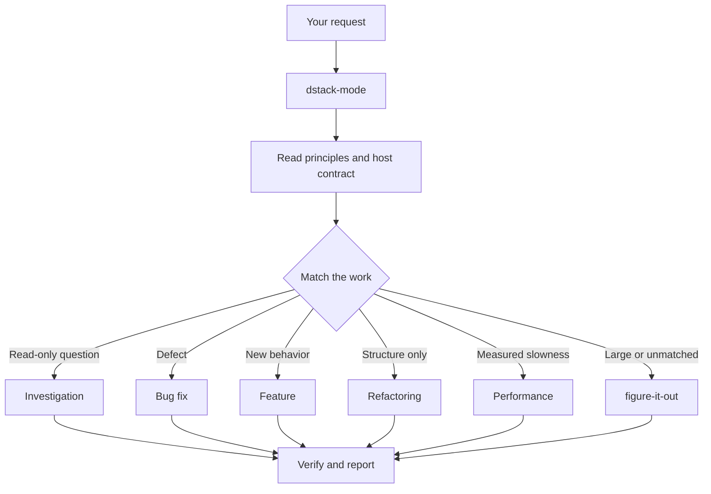

# Route work through dstack-mode

`dstack-mode` is the normal front door. Give it the outcome and constraints;
the mode selects a playbook and invokes focused skills when their decision
points arrive.

## What happens to a request



The current mode contains 22 playbooks:

- investigation, bug fix, performance, hillclimb;
- runtime and trace forensics;
- feature, refactoring, prototype, visual parity;
- authoring and evaluating skills;
- babysit, shipping, autonomous run;
- full and stack autopilot;
- session pickup, pause safely, multi-phase plan;
- opening a PR and worktree cleanup.

Pstack's Orchestrate playbook is out of scope for dstack. `figure-it-out` and
Autonomous run cover ambitious work that still fits a bounded agent run.

## Prompt with outcomes

For a bug:

```text
dstack-mode: users receive two notifications after a retry. Reproduce the
failure first, fix the cause, and prove a normal send still produces one.
```

For a feature:

```text
dstack-mode: add JSON output to this command. Text output must remain
byte-identical; run both modes against the sample project.
```

For investigation only:

```text
dstack-mode: explain why this cache survives logout. Do not change code.
```

State a finish condition that can be observed. A build or typecheck may be the
right proof for a type-only change, but it is not browser, native, database, or
external-system proof.

## Do not prescribe the ceremony

Avoid prompts such as:

```text
Run how, then architect, then arena, then tdd, then no-comments.
```

That duplicates the mode's routing job and can put a workflow in the wrong
phase. Name a focused skill when you deliberately want to override the normal
route, not because every rigorous task needs every skill.

## Parallel work and isolation

Parallelize independent artifacts and questions. Keep code-coupled work under
one owner, and give concurrent writers disjoint worktrees or paths. If the host
cannot enforce isolation, treat the boundary as advisory and disclose it.

The lead agent owns decomposition, synthesis, final judgment, and verification.
Helper summaries are evidence pointers; recheck load-bearing claims against the
source or real artifact.

## Bundled scripts

`dstack-mode` ships one script, `scripts/worktree-audit.sh`. It classifies every
git worktree by size, merge state, uncommitted work, remote and PR state, and
the most recent chat that touched it, then prints a table sorted by size with a
suggested bucket. It never deletes; the Worktree cleanup playbook keeps deletion
human-gated.

Set `AGENT_TRANSCRIPTS_DIR` to your host's transcript directory for the active
workspace to populate the `LAST_CHAT` column. Unset, that column reports `-` and
every other column still works.

## Long-running work

Use Autonomous run when one standing agent can drive a task to a predicate. Use
`figure-it-out` when an ambitious run needs a bespoke auditable playbook. Leave
a durable handoff when the host cannot wake or persist the session.

Multi-day programs spanning many tracks, PRs, and coordinator restarts are out
of scope. Say so and scope the work down to runs these playbooks can carry,
rather than improvising a coordinator.

Next: [Choose focused workflows](./04-workflows.md).
