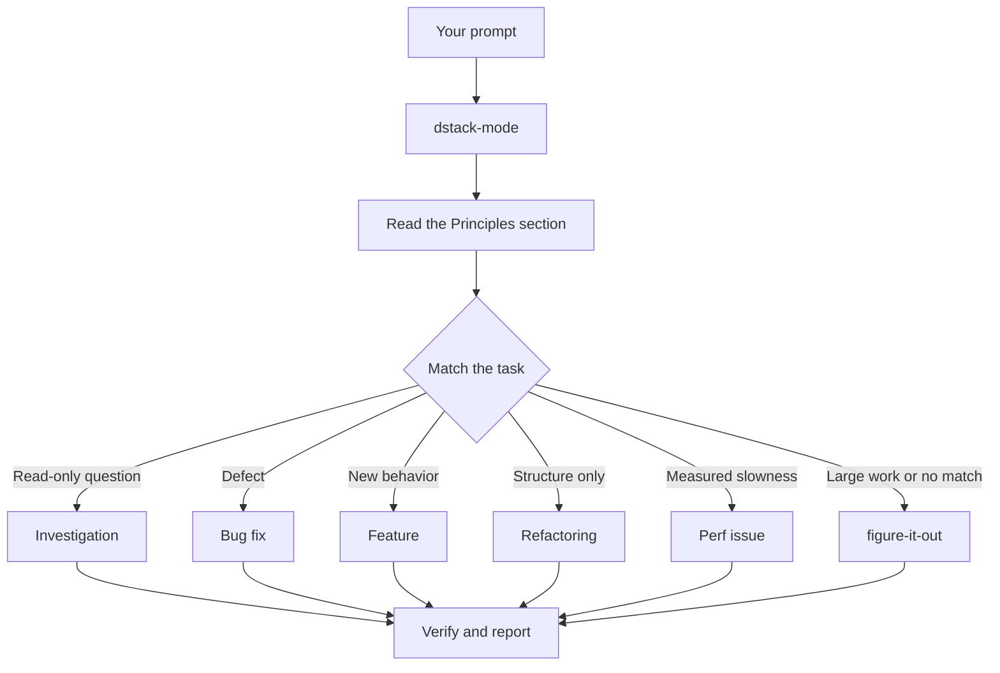

# Route work through `/dstack-mode`

`/dstack-mode` is the front door. You give it a goal, it matches one of eighteen playbooks, copies that playbook's steps into the todo list, and calls the other skills as the steps need them. In this page you learn what a good prompt looks like, and how little of one you actually need.

## What happens to your prompt



The diagram shows the common routes. There are also playbooks for hillclimbing a metric, diagnosing runtime symptoms and captured traces, prototypes, visual parity, authoring and evaluating skills, babysitting a PR or merge request to merge-ready, explicitly opening a request, session pickup, pausing safely, multi-phase plans, and Apple development cleanup. The [playbook directory](../../../dstack-mode/playbooks/) has the full set.

## Say the goal, not the ceremony

You don't write a spec. You say what's wrong or what you want, plus anything you already know that saves the agent time:

```text
/dstack-mode users get two notifications after a retry. repro first, then fix and verify.
```

That's a Bug fix prompt. "repro first" is a real constraint, not politeness, and the playbook honors it. Watch the todo list fill with the Bug fix steps. A skipped step stays visible with `skip: <reason>`.

## What goes in a prompt

A useful prompt carries up to five things, and each one fits in a sentence:

- **The goal.** Say what's wrong, or what you want.
- **The done check.** It must be able to pass or fail. "Make it better" and "work on it for an hour" aren't checks.
- **The proof you want to see.** Ask for the real command output, a video of the flow, the stored value, or a before-and-after number.
- **What you already know.** A symptom, a repro step, a log line, or a link saves the agent a search.
- **The real constraints.** "repro first", "don't change any code yet", "zero behavior change", and "let me review before proceeding" each change what the agent does.

Here's one prompt with all five:

```text
/dstack-mode the csv export drops its last row since yesterday's deploy. failing job id is 4812. repro first, then fix. done means the 60k-row fixture exports every row. show me the row counts before and after.
```

Two things are worth leaving out:

- **The how.** Say what to achieve, and leave the agent room to find a better path than the one you'd pick. The same goes for a list of skills, covered in the pitfall below.
- **Your theory of the cause, at first.** A stated guess narrows the search to wherever you pointed. Let the agent restate the problem before you share your hunch.

For a noisy report, such as a long thread or a vague bug, make the restatement the first step:

```text
/dstack-mode read this thread. restate the underlying issue in your own words, in plain english. don't change any code yet.
```

A misreading shows up in the restatement, before any code exists. Correct it there, and it costs you one message instead of one wrong fix.

## Follow up short

When the conversation already carries the context, the prompt shrinks to almost nothing. All of these are enough:

```text
/dstack-mode do it
```

```text
continue
```

```text
keep going until done
```

Short works because the playbook holds the structure while the active harness keeps it in context. [Set up dstack](./01-setup.md#run-your-first-task) shows how to start. Your words carry the intent, and the skill carries the rigor.

## Switch tasks with "new task"

A long chat accumulates context from the last task. When you change subjects, say so:

```text
/dstack-mode new task. figure out why the cache entry survives logout. don't change any code yet.
```

"new task" tells `/dstack-mode` to re-match rather than continue the prior playbook. "don't change any code yet" pins this one to Investigation. Without those two phrases, a mode mid-Feature tends to treat your question as the next feature step.

## Keep parallel work independent

If you run several agents against one writable checkout, they can fight over the files, ports, and build output. Dstack serializes repository writers in the active checkout. Native subagents may fan out read-only analysis or write independent artifacts outside the repository. Required work runs in bounded waves when there are fewer child slots than requested.

For a coverage pass, give each worker a read-only slice:

```text
/swarm check every package against its check script. one read-only worker per package. one report.
```

Dstack does not create or clean Git worktrees. See [Supported scope](./06-supported-scope.md) for that boundary.

## Leave it running

While the active local session can supervise the work, say what done means:

```text
/dstack-mode im stepping away. keep going until the migration check reports zero old callers. log your decisions.
```

Work you'll review later routes through [`/figure-it-out`](../../../figure-it-out/SKILL.md), which designs the run's phases and keeps a [`/show-me-your-work`](../../../show-me-your-work/SKILL.md) decision log. The [mode skill](../../../dstack-mode/SKILL.md#mode-lifetime) defines the active-session boundary, and [`/show-me-your-work`](../../../show-me-your-work/SKILL.md) explains how to audit the decision log.

**Pitfall:** don't enumerate skills in your prompt ("use /how, then /architect, then /arena..."). The playbook already sequences them, and a hand-written sequence usually reorders or drops steps the playbook would have kept. Name a skill only when you want to override a specific choice.

Read [`dstack-mode`](../../../dstack-mode/SKILL.md) itself for the full routing rules.

Next: [Verify the result and open a PR](./06-verify-and-ship.md).
